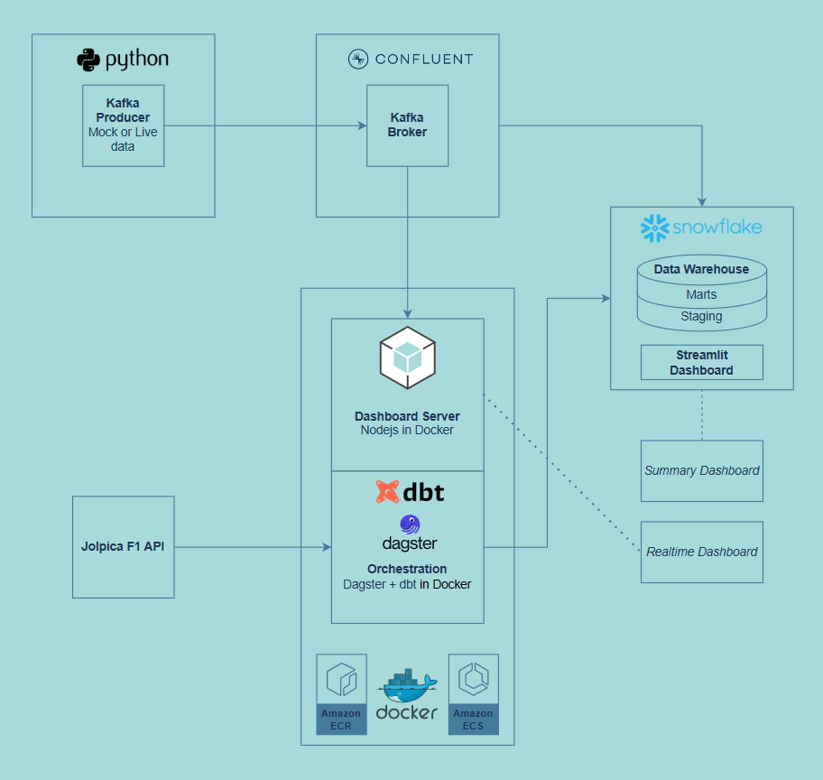
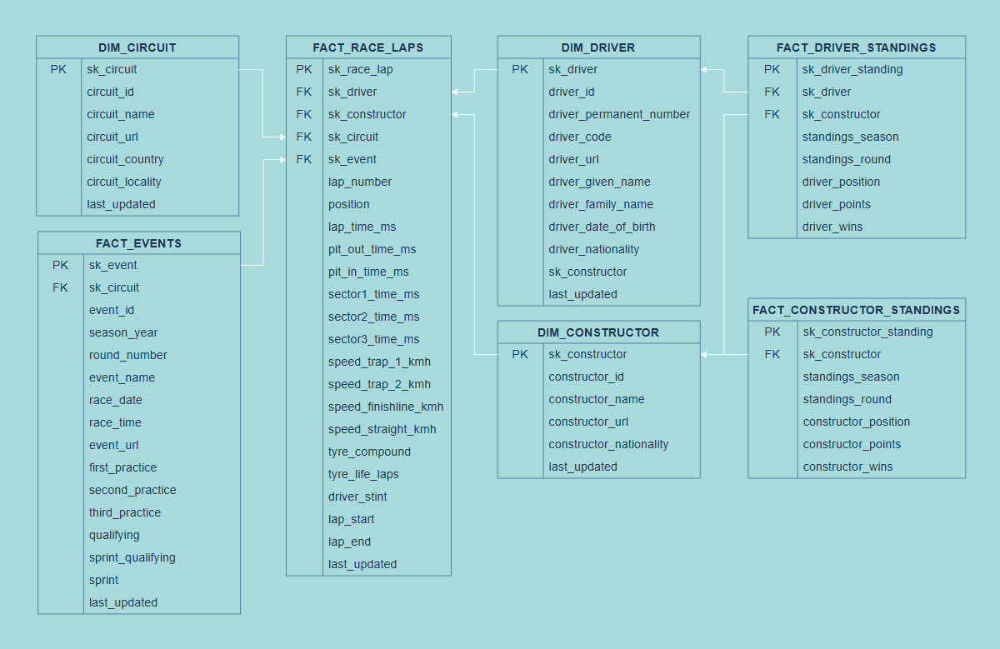
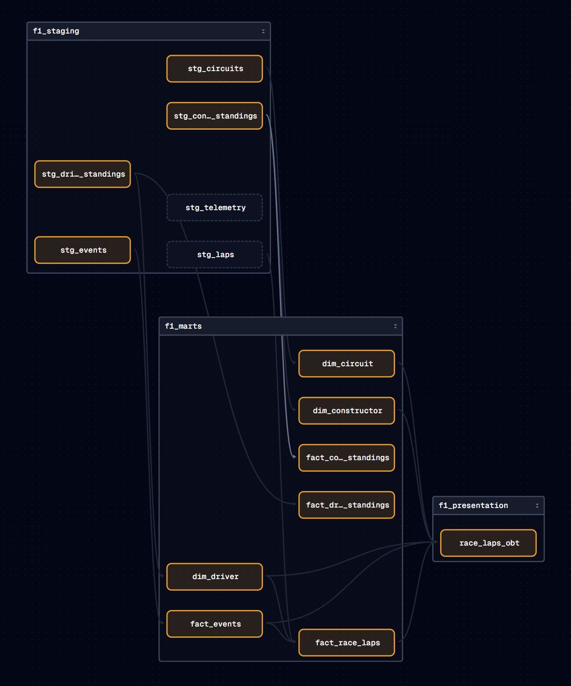

 [](https://github.com/b-geo/DEC-P3/actions/workflows/deploy.yaml)
[](https://github.com/b-geo/DEC-P3/actions/workflows/lint.yml)


 # 🏎️ Introduction
Formula 1 has evolved beyond simple lap times and speed measurements to utilise comprehensive data analytics in all aspects of decision making and performance evaluation. Not only do teams require this data, but spectators equally enjoy the insights that can be extracted. This project ultimately converges on two dashboards, a realtime race dashboard and a post race summary dashboard. It is worth noting the dashboards display only a fraction of the overall insights available from the data.

## Project Structure

The repository is organized into four main components:

- **Infrastructure**: Builds the required cloud architecture
- **Kafka Producer**: Provides lap data and telemetry data to Kafka topics
- **Orchestration**: Handles ELT operations for batch data processing
- **Presentation**: Dashboards for both real-time and batch data visualization

```
┣ infra
┣ kafka_producer
┣ orchestration
┃ ┣ dagster_pipeline
┃ ┃ ┣ assets
┃ ┃ ┃ ┣ dbt
┃ ┃ ┃ ┣ jolpi
┣ presentation
┃ ┣ snowflake_streamlit
┃ ┗ streaming_dashboard
 ```

# Data Sources

### Event Data
Event data is captured during races and streamed by F1.com. There are two primary data streams:

1. **Car Telemetry**: Polls approximately every 200ms during live races
2. **Lap Summary Data**: Provided per driver per lap

For historical race data, the [Fast-F1 library](https://github.com/theOehrly/Fast-F1) is utilised.

**Telemetry Data Example:**
```json
{
    "Date": 1742099338869,
    "SessionTime": 4896250,
    "DriverAhead": "27",
    "DistanceToDriverAhead": 48.685,
    "RPM": 8414.0,
    "Speed": 74.0,
    "nGear": 1,
    "Throttle": 32.0,
    "Brake": false,
    "DRS": 1,
    "Distance": 68.1011111111,
    "RelativeDistance": 0.0129132137,
    "Status": "OnTrack",
    "X": -1449.1830563296,
    "Y": -886.9041600145,
    "Z": 82.0,
    "Lap": 5,
    "Driver": "ANT",
    "date_delta": 0
}
```

**Lap Data Example:**
```json
{
    "Driver": "PIA",
    "LapTime": 143155,
    "LapNumber": 5.0,
    "Stint": 4.0,
    "PitOutTime": 4871064,
    "PitInTime": null,
    "Sector1Time": 53433,
    "Sector2Time": 32176,
    "Sector3Time": 57546,
    "Sector1SessionTime": 4922486,
    "Sector2SessionTime": 4954662,
    "Sector3SessionTime": 5012208,
    "SpeedI1": 87.0,
    "SpeedI2": 199.0,
    "SpeedFL": 252.0,
    "SpeedST": 189.0,
    "Compound": "INTERMEDIATE",
    "TyreLife": 5.0,
    "FreshTyre": false,
    "Team": "McLaren",
    "LapStartTime": 4868974,
    "LapStartDate": 1742099311593,
    "TrackStatus": "4",
    "Position": 3.0
}
```

### Entity Data
Entity data encompasses the metadata of races, including driver details, championship standings, team information, and circuit details. This data is typically updated after each race round and is ingested from the [Jolpica F1 API](https://github.com/jolpica/jolpica-f1).

**Driver Data Example:**
```json
{
    "driverId": "albon",
    "permanentNumber": "23",
    "code": "ALB",
    "url": "http://en.wikipedia.org/wiki/Alexander_Albon",
    "givenName": "Alexander",
    "familyName": "Albon",
    "dateOfBirth": "1996-03-23",
    "nationality": "Thai"
}
```
## Prerequisites

Before getting started, you will need:

- [AWS Account](https://aws.amazon.com/resources/create-account/)
- [AWS CLI](https://docs.aws.amazon.com/cli/latest/userguide/getting-started-quickstart.html) with access key and secret access key configured
- [Confluent Account](https://www.confluent.io/get-started/)
- [Snowflake Account](https://signup.snowflake.com/)
- [Terraform](https://developer.hashicorp.com/terraform/install) installed locally

*Note: No manual pip install or npm install is required as dependencies are handled by Dockerfiles.*

## Setup Instructions

### Initial Repository Setup
1. Fork this repository and clone it locally: `git clone <your-forked-repo>`
2. Enable GitHub workflows for your forked repository

### GitHub Secrets Configuration
Add the following secrets to your GitHub repository:

- `AWS_ACCESS_KEY_ID`
- `AWS_SECRET_ACCESS_KEY`
- `SNOWFLAKE_ACCOUNT`
- `SNOWFLAKE_DB`
- `SNOWFLAKE_PASSWORD`
- `SNOWFLAKE_ROLE`
- `SNOWFLAKE_USER`
- `SNOWFLAKE_WAREHOUSE`

*Note: Snowflake credentials are required for SQLFluff's dbt compilation checks.*

### Snowflake Database Setup
Configure Snowflake with the following structure:
- Database: `f1`
- Schema: `staging`
- Schema: `marts`

### Confluent Configuration

#### Cluster and Topics
1. Create a new Confluent cluster
2. Set up two topics: `f1_laps` and `f1_tele`
   - Messages use driver code as the key to ensure correct message ordering for live position updates

#### Snowflake Connector
1. Add a [Snowflake Sink Connector](https://docs.confluent.io/cloud/current/connectors/cc-snowflake-sink/cc-snowflake-sink.html)
2. Map `f1_laps` topic to `stg_laps` table in Snowflake
3. Map `f1_tele` topic to `stg_telemetry` table in Snowflake

### AWS S3 Environment Configuration
ECS tasks and services require a `.env` file stored in S3 for environment variables:

1. Complete the `template.env` file with your configuration details and rename it to `.env`
2. Create a new S3 bucket and upload the `.env` file
3. Note the S3 location for use in `terraform.tfvars`

### Terraform State Management
Terraform state is managed via GitHub Actions with the `terraform.tfstate` file stored on S3:

1. Edit `terraform.tfvars` with your specific configuration
2. Configure AWS CLI: `aws configure`
3. Initialize Terraform: `terraform init`
4. Apply Terraform configuration: `terraform apply`
5. Upload the generated `terraform.tfstate` file to a separate S3 bucket
6. Update `main.tf` to reflect your Terraform state file location

## Architecture

### Solution Architecture
<div align="left">
  
</div>

### Entity Relationship Diagram
<div align="left">
  
</div>

### Dependency Graph
<div align="left">
  
</div>

## Component Details

### Kafka Producer
F1.com streams live data via SignalR during races without authentication requirements. The [Fast-F1 library](https://github.com/theOehrly/Fast-F1) assists in consuming and combining this data meaningfully. 

For production environments, data should be produced directly from the SignalR stream to a Kafka broker. However, since live events are not always available for development, this project uses Fast-F1 to retrieve historical data from the first round of the 2025 season, storing lap and telemetry data as `.jsonl` files. A Python script acts as a Kafka producer, posting messages to two Kafka topics (`f1_tele` and `f1_laps`) with driver codes as keys to ensure proper partitioning.

The Kafka topics serve two consumers: the real-time dashboard and the Snowflake sink connector.

### Orchestration
All tables from staging to presentation are stored in Snowflake. The staging layer consists of:
- `stg_telemetry` and `stg_laps`: Populated from Kafka connector
- Entity tables (driver, constructor, circuit): Consumed from Jolpica F1 API

Staging assets are scheduled to refresh every two days.

dbt, orchestrated through Dagster, transforms staging tables for the marts layer. The presentation layer contains a comprehensive fact table that serves as the data source for Streamlit dashboards. Both marts and presentation layers use the "eager" Automaterialize policy to ensure changes flow through automatically when staging tables are updated.

### Presentation
The presentation layer includes:
- **snowflake_streamlit**: Used for summary data visualization
- **streaming_dashboard**: Used for real-time data display

For Snowflake Streamlit apps, copy the contents of the project's `environment.yml` and `streamlit_app.py` files directly to your Streamlit application files.

The streaming dashboard is containerised as a Docker image, managed through GitHub Actions. It features a Node.js server that consumes both Kafka topics and provides data to the web interface via WebSocket, ensuring low latency through the unified server architecture.

### Infrastructure and CI/CD
Infrastructure is primarily provisioned through GitHub workflows triggered on merges to main or manual execution. Terraform manages ECR repositories, ECS clusters, and ECS tasks as the first job in the deployment workflow. The workflow outputs configure subsequent jobs that build Docker images, push them to ECR, and update ECS tasks. Docker images are built only when changes affect their respective folders.

The streaming dashboard and orchestration containers run in the same ECS cluster but use different Capacity Providers:
- **Streaming Dashboard**: Configured for small EC2 instances
- **Orchestration**: Configured for AWS Fargate

An additional workflow handles Python and SQL code linting, automatically fixing formatting issues where possible and requiring manual fixes for issues beyond automatic correction capabilities.

## Notes and Limitations

**Data Scope:** The custom Jolpica F1 API class within Dagster is currently configured to retrieve data for the current season and round only. To access historical data, both the Dagster assets and Jolpica F1 API class would require modification to support backfilling operations.

**Testing and Logging:** These things definitely took a backseat in this project in order to get it done on time. There is of course some basic testing in dbt, as well as linting through Github actions, but this is far from complete.

**JavaScript Linting:** Although portions of this project utilise JavaScript, the current GitHub linting workflow does not include JavaScript code validation.
