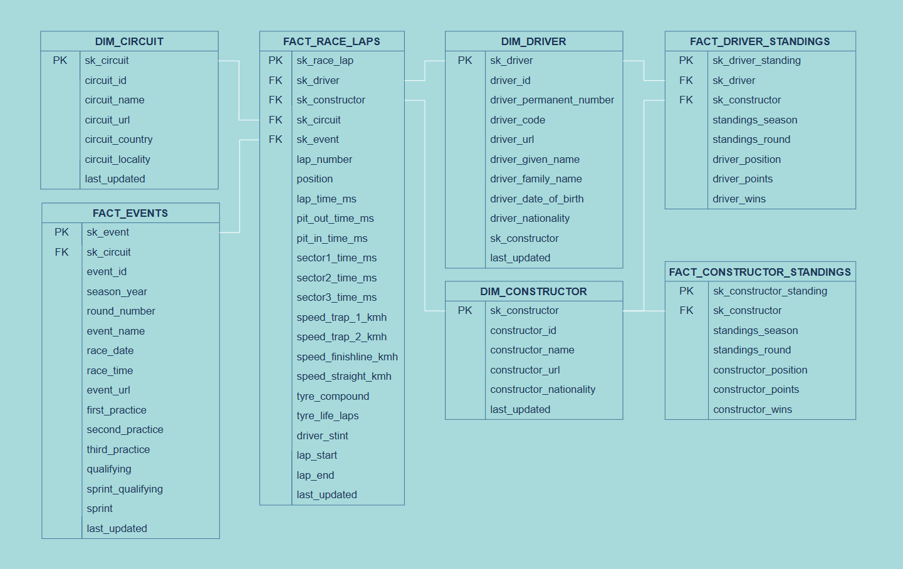

 [](https://github.com/b-geo/DEC-P3/actions/workflows/deploy.yaml)
[](https://github.com/b-geo/DEC-P3/actions/workflows/lint.yml)


 # 🏎️ Introduction
Once upon a time it was enough to know lap times and speed, but F1 has now evolved to utilise data in all aspects of decision making and evaluation. Not only do teams require this data, but spectators equally enjoy the insights that can be extracted. This project ultimately converges on two dashboards, a realtime race dashboard and a post race summary dashboard. The depth of data housed on Snowflake is deeper than what is currently provided on these two dashbaords.

 # The Components
You will notice these main folders in the root directory, here is a guide to their contents.
- Infrastructure: builds the cloud architecture required.
- Kafka Producer: provides lap data and telemetry data to Kafka topics.
- Orchestration: handles ELT of batch data.
- Presentation: dashboards for both realtime data and batch data.

```
┣ infra
┣ kafka_producer
┣ orchestration
┃ ┣ dagster_pipeline
┃ ┃ ┣ assets
┃ ┃ ┃ ┣ dbt
┃ ┃ ┃ ┣ jolpi
┣ presentation
┃ ┣ snowflake_streamlit
┃ ┗ streaming_dashboard
 ```

# Source Data
## Event Data
This is data captured during the race and streamed by F1.com. There are two streams of event data, one for car telemetry that polls approximately every 200ms, and lap summary data that is provided per driver per lap. For previous races, the Fast-F1 library (https://github.com/theOehrly/Fast-F1) is available.
```
Telemetry data example:
{
    "Date":1742099338869,
    "SessionTime":4896250,
    "DriverAhead":"27",
    "DistanceToDriverAhead":48.685,
    "RPM":8414.0,
    "Speed":74.0,
    "nGear":1,
    "Throttle":32.0,
    "Brake":false,
    "DRS":1,
    "Distance":68.1011111111,
    "RelativeDistance":0.0129132137,
    "Status":"OnTrack",
    "X":-1449.1830563296,
    "Y":-886.9041600145,
    "Z":82.0,
    "Lap":5,
    "Driver":"ANT",
    "date_delta":0
}
```
```
Lap data example:
{
    "Driver":"PIA",
    "LapTime":143155,
    "LapNumber":5.0,
    "Stint":4.0,
    "PitOutTime":4871064,
    "PitInTime":null,
    "Sector1Time":53433,
    "Sector2Time":32176,
    "Sector3Time":57546,
    "Sector1SessionTime":4922486,
    "Sector2SessionTime":4954662,
    "Sector3SessionTime":5012208,
    "SpeedI1":87.0,
    "SpeedI2":199.0,
    "SpeedFL":252.0,
    "SpeedST":189.0,
    "Compound":"INTERMEDIATE",
    "TyreLife":5.0,
    "FreshTyre":false,
    "Team":"McLaren",
    "LapStartTime":4868974,
    "LapStartDate":1742099311593,
    "TrackStatus":"4",
    "Position":3.0
}
```
## Entity Data
Entity data covers essentailly the metadata of a race - driver details, driver championship standings, team details, circuit details.This data generally changes after each round. This was ingested from the Jolpica F1 API (https://github.com/jolpica/jolpica-f1).
```
Driver data example:
{
    "driverId": "albon",
    "permanentNumber": "23",
    "code": "ALB",
    "url": "http://en.wikipedia.org/wiki/Alexander_Albon",
    "givenName": "Alexander",
    "familyName": "Albon",
    "dateOfBirth": "1996-03-23",
    "nationality": "Thai"
}
```

# Getting Started
**You will need**
- An AWS account (https://aws.amazon.com/resources/create-account/)
- AWS CLI - access key and secret access key method (https://docs.aws.amazon.com/cli/latest/userguide/getting-started-quickstart.html)
- A Confluent account (https://www.confluent.io/get-started/)
- A Snowflake account (https://signup.snowflake.com/)
- Terraform installed locally (https://developer.hashicorp.com/terraform/install)
*There is no need to pip install or npm install as this is handled by the Dockerfiles.

Next,
1. Fork this repo then ```git clone``` it so you have a local version.
2. Enable workflows of Github for you forked version. 

## Github Secrets
1. Add the following secrets to Github for your repo.
- AWS_ACCESS_KEY_ID
- AWS_SECRET_ACCESS_KEY
- SNOWFLAKE_ACCOUNT
- SNOWFLAKE_DB
- SNOWFLAKE_PASSWORD
- SNOWFLAKE_ROLE
- SNOWFLAKE_USER
- SNOWFLAKE_WAREHOUSE

The reason Snowflake details are needed is because as part of SQLFluff's checks it will compile dbt - which requires those details.

## Snowflake Database and Schemas
1. Set up Snowlfake with:
    - A Database called "f1"
    - A Scheme called "staging"
    - A Schema  called "marts"

## Confluent 
### Cluster and Topics
1. Add a new Confluent cluster
2. Set up two Topics, "f1_laps" and f1_tele". Both of these Topics require 20 partitions (the amount of drivers). Each message to the topic uses the driver code as a key and this ensures the correct order for messages - important when updating live position.
### Snowflake Connector
1. Add a new Snowflake Sink Connector (https://docs.confluent.io/cloud/current/connectors/cc-snowflake-sink/cc-snowflake-sink.html?ajs_aid=15f7888d-2eec-438c-9c48-1f118dba39e4&ajs_uid=5710910#cc-snowflake-db-sink-gen-key-pair)
2. Map f1_laps Topic to stg_laps table in Snowflake.
3. Map f1_tele Topic to stg_telemetry in Snowflake.

## AWS S3 .env
ECS tasks/services will rely on a ```.env``` in a S3 bucket for environment variables. Terraform specifies the location of this when creating ECS tasks.
1.Complete the ```template.env``` in this project with your details then rename to ```.env```. These details should be the same as your Github secrets, plus a few extra.
2. Create a new S3 bucket and upload your ```.env``` to this. You will need this location for ```terraform.tfvars`` in the next step.

## Terraform state file
Terraform, via Github Actions has been configured to manage state with its ```terraform.tfstate``` file located on S3. First, Terraform must be run locally, then you can upload the state file to S3. To do this:
2. With your cloned local copy, edit ```terraform.tfvars``` as needed.
3. Run aws configure to login to you AWS account.
4. Run ```terraform init```
5. Run ```terraform apply```
6. Once this is complete the infrastructure folder that houses the Terraform files should have an additional file called ```terraform.tfstate```.
7. Upload this to a separate S3 bucket. Your repo should now have an updated ```terraform.tfvars``` to your liking and ```main.tf``` should reflect the locatoin of yor Terraform state file.


# Solution Architecture
<div align="left">
  
</div>

# Entity Relationship Diagram
<div align="left">
  
</div>

# Dependency Graph

# More Detail on Each Component
## Kafka Producer
F1.com does stream live data via the SignalR during races and there is no authentication required to ingest this. FastF1 (https://github.com/theOehrly/Fast-F1) if a Python library which assists consuming the data and combining it in meaningful ways. In a production setting, it would be best to produce this data directly from the SignalR stream to a Kafka broker, however, that means
- f1 actually has real data available by the signalr protocol - but only available during events.
- cluster per driver to keep right order
- i used a python library to get the data from a previous event (Aus Grand Prix 2025)
- there's obviously a lot of it per event so i've just done this part for the one event
- i have sent that to a kafka topic (confluent)
    - a snowflake connector on confluent sends that to a staging table in snowflake
        - stg_laps
        - stg_telemetry
    - a realtime dashboard receives the telemetry and displays the race

# Orchestration
- dagster materializes assets
    - jolpi api for staging to snowflake - every second day schedule
    - dbt then transforms and turns to marts - automaterialize eager
    - the tables that are materialized through the kafka snowflake connector are also registered with dagster through being source assets.
- partition by date snowflake


# Presentation
- streamlit on snowflake is used for some charting. the two files required for the streamlit app are in this repo. this is matplotlib mainly and sql like spark
- the realtime dashboard uses a nodejs server where the kafka topic is consumed then through that same server websocket passes it to the website

# Infrastructure and CI/CD
- using terraform to setup ecr, ecs, ecs tasks
- new docker image is loaded to ecr with github actions and task definition updated
- currently its manual tasks and i didn't want to setup a service that is alwasy running for this project, but i could have the task definition update on an existing service for sure
- tasks and containers for the realtime dashboard and dagster orchestration are separate. dashboard is designed with an ec2 cluster and dagster is fargate - this is purely because i wanted to challenge myself a bit with terraform and dagster needed more than the free tier level. same reason i didn't use dagster plus.

# ci/cd
- two workflows
    - deploy
        - build
        - terraform
    - linting
- linting runs on pull requests
- terraform runs on merges to main
- the building and pushing of the docker container will only happen if there are changes to folder that would affect either docker image.
- linting is sqlfluff and black. an error will force the developer to fix locally then remerge.

**if i get time
-  s3 bucket .env is read to use in github actions instead of using github secrets
-  backfill option for dagster jolpi data - all rounds
- auto materialize assets dagster. jolpi runs regularly and marts the auto run because of that
- dbt snapshot for slowly changing dimensions
- race results based on fact_laps
- dbt tests
- first_practice etc should be first_practice_date since date
- STANDINGS tables should have event sk as well

**unsure
- should standings by fact table? probably.

**to say
- now of course there were shortcuts to make in this time
    - theres no test branch before pushing to main
        - and no tests, logs
    
# Notes and Limitations
- Within Dagster the Jolpica F1 API class is set up to get data on the current season and round only. In order to get historical data, the Dagster asset and Jolpica F1 API class would need to be configured for backfilling.
- Names of databases, schemas, topics, tables and AWS infrastructure can all be changed, but I have not (yet) set up one config file to make this more seamless.
- Logging and testing definitely took a backseat in this project in order to get it done on time. There is of course some basic testing in dbt, as well as linting through Github actions, but this is far from complete.
- Terraform is currently set up to define the ECS tasks, but it isn't configured to update a running service. If this was to be used in production it would be configured as a consistent service that is updated.
- Although part of this project uses Javascript, there isn't yet any Javascript linting happening in the Github linting workflow.
- Although both the Realtime Dashboard and Orchestration Docker containers run in one ECS cluster, they're actually configured for different Capacity Providers. The Realtime Dashboard container is configured for a small EC2 instance, while the Orchestration container is configured for FARGATE. I could have just chosen a larger EC2 instance and run both, but I wanted to play around with Terraform.